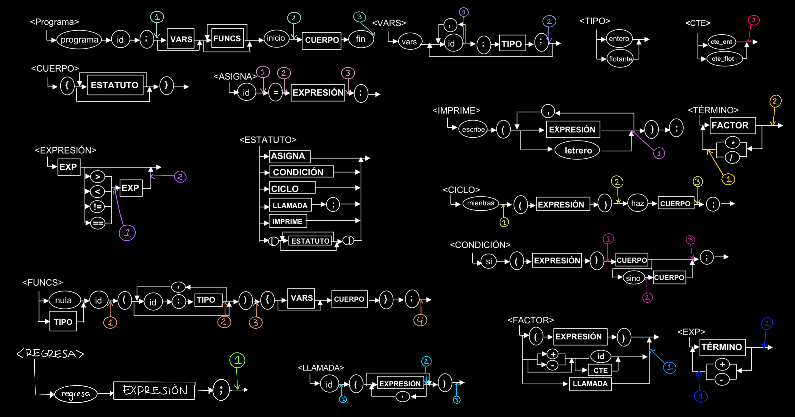

# Compilador Patito

Lenguaje **Patito**, implementado en C++ con Flex y Bison.

## Definición del lenguaje



---

## Estructura del proyecto

```
compiladores/
├── Compilador/
│   ├── scanner.l           # Analizador léxico (Flex)
│   ├── parser.y            # Analizador sintáctico y semántico (Bison)
│   ├── runner.cpp          # Punto de entrada — conecta compilador con VM
│   ├── Makefile
│   └── helpers/
│       ├── Table.h         # Tabla hash genérica (clave-valor)
│       ├── Stack.h         # Pila genérica
│       ├── Node.h          # Nodo para estructuras de datos
│       ├── SemanticCube.h  # Cubo semántico — validación de tipos
│       ├── Memory.h        # Gestor de direcciones virtuales (compilación)
│       ├── FuncDir.h       # Directorio de funciones y tabla de variables
│       ├── QuadrupleBuilder.h  # Generador de cuádruplos
│       ├── ActivationRecord.h  # Registro de activación (frame de función)
│       ├── ExecutionMemory.h   # Memoria de ejecución en runtime
│       └── VirtualMachine.h    # Máquina virtual — intérprete de cuádruplos
├── TestCases/              # Casos de prueba principales
└── README.md
```

---

## Mapa de memoria virtual

Las direcciones virtuales codifican tipo y scope:

| Rango       | Segmento              |
|-------------|-----------------------|
| 1000–1999   | Globales enteros      |
| 2000–2999   | Globales flotantes    |
| 3000–3999   | Locales enteros       |
| 4000–4999   | Locales flotantes     |
| 5000–5999   | Temporales enteros    |
| 6000–6999   | Temporales flotantes  |
| 7000–7999   | Constantes enteras    |
| 8000–8999   | Constantes flotantes  |
| 9000–9999   | Constantes string     |

---

## Compilar el proyecto

```bash
cd Compilador
make
```

Para limpiar archivos generados:

```bash
make clean
```

---

## Correr un programa Patito

```bash
./compilador <archivo.patito>
```

Ejemplo:

```bash
./compilador ../TestCases/factorialEnFuncion.patito
```

---

## Casos de prueba

| Archivo | Descripción |
|---|---|
| `factorialEnMain.patito` | Expresiones, ciclo `mientras`, `escribe` |
| `factorialEnFuncion.patito` | Función con retorno, parámetros, llamadas múltiples |
| `fibonnaciEnMain.patito` | Ciclo, múltiples variables, operaciones |
| `fibonnaciEnFuncion.patito` | Función `nula`, parámetro, ciclo interno |
| `variableGlobal.patito` | Acceso a variable global desde función |
| `multiplesLlamadas.patito` | Activation record creado/destruido múltiples veces |
| `multiplesParametros.patito` | Función con 3 parámetros |

Correr todos los casos de prueba:

```bash
for f in ../TestCases/*.patito; do
    echo "=== $f ==="
    ./compilador "$f"
done
```

## Operadores

El compilador genera cuádruplos intermedios con los siguientes codigos de operación:

| Opcode   | Descripción                          |
|----------|--------------------------------------|
| `=`      | Asignación                           |
| `+` `-` `*` `/` | Operaciones aritméticas       |
| `>` `<` `==` `!=` | Comparaciones              |
| `GOTO`   | Salto incondicional                  |
| `GOTOF`  | Salto si falso                       |
| `PRINT`  | Imprimir valor                       |
| `ERA`    | Reservar espacio para llamada        |
| `PARAM`  | Pasar parámetro                      |
| `GOSUB`  | Llamar función                       |
| `RETURN` | Retornar valor                       |
| `ENDFUNC`| Fin de función                       |
| `END`    | Fin del programa                     |
